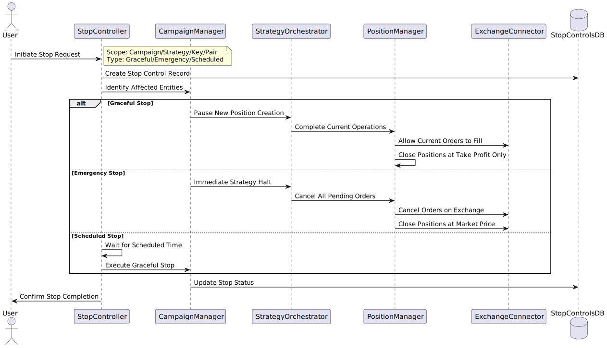

# Technical Specification: Spot Trading Bot with Smart DCA Strategy (TDD)

> ⚠️ This document describes the implementation of Smart DCA strategy: architecture, database schemas for positions, DCA algorithms, position state recovery mechanisms, security and monitoring.

## 1. Project Overview
- Enterprise-grade bot for spot trading with **Smart DCA strategy**.
- **"Never sell at a loss" principle** - only LONG positions.
- Multi-key API management with binding to DCA positions.
- Critical security systems and position state recovery.
- Zero data loss for positions (state recovery).

## 2. System Architecture
- Backend: Go v1.25 (new systems: **Position State Manager**, **DCA Engine**, Key Manager, Trading Engine).
- DB: MySQL 8 (positions, DCA levels, operation history, WAL).
- Redis: cache (quotes, position states, statistics).
- API: RESTful (React client + Position Management + Emergency Stop + Key Management).
- Exchanges: HitBTC (MVP), Binance (next version).
- Security: AES-256-GCM for keys, WAL encryption, distributed locks for positions.

## 3. Critical Systems for DCA
- **Position State Recovery**: restore state of all active DCA positions after failure <30 sec.
- **DCA Trigger Engine**: price monitoring and automatic DCA level triggering.
- **Take Profit Manager**: manage partial sales only in profit.
- **Emergency Position Management**: emergency stop of all positions with state preservation.
- **Advanced Risk Management**: exposure control per key/pair, overtrading protection.
- **Enterprise Monitoring**: Prometheus, Grafana, DCA strategy efficiency monitoring.

## 4. Functional Requirements for DCA
- DCA position management (creation, monitoring, completion).
- Automatic DCA level triggering on price drops.
- Partial sales only above position average price.
- Position binding to API keys with load balancing.
- Position state recovery after restart.
- Risk management: maximum exposure per key, position limits.

## 5. API Specification for DCA (Extended)

### 5.1 Position Management
```http
POST /api/v1/positions - create new DCA position
GET /api/v1/positions - list active positions
GET /api/v1/positions/{id} - position details
PUT /api/v1/positions/{id}/pause - pause position
PUT /api/v1/positions/{id}/resume - resume position
DELETE /api/v1/positions/{id} - emergency close position
```

### 5.2 DCA Monitoring
```http
GET /api/v1/positions/{id}/dca-levels - current DCA levels
GET /api/v1/positions/{id}/take-profits - take profit levels
GET /api/v1/positions/{id}/history - position operation history
GET /api/v1/analytics/dca-performance - DCA efficiency analytics
```

### 5.3 Strategy Settings
```http
GET /api/v1/strategy/dca-settings - current DCA settings
PUT /api/v1/strategy/dca-settings - update DCA settings
GET /api/v1/strategy/supported-pairs - supported trading pairs
```

## 6. Database Schemas for DCA Strategy

### 6.1 Main Position Tables
```sql
-- Main DCA positions table
CREATE TABLE dca_positions (
    id BIGINT PRIMARY KEY AUTO_INCREMENT,
    trading_pair VARCHAR(20) NOT NULL,
    api_key_id BIGINT NOT NULL,

    -- Position state
    status ENUM('active', 'completed', 'paused', 'emergency_stopped') DEFAULT 'active',

    -- Financial data
    total_invested DECIMAL(18,8) DEFAULT 0,
    total_quantity DECIMAL(18,8) DEFAULT 0,
    average_price DECIMAL(18,8) DEFAULT 0,
    realized_profit DECIMAL(18,8) DEFAULT 0,

    -- DCA parameters
    initial_amount DECIMAL(18,8) NOT NULL,
    max_dca_levels INT DEFAULT 3,
    current_dca_level INT DEFAULT 0,

    -- Timestamps
    created_at TIMESTAMP DEFAULT CURRENT_TIMESTAMP,
    updated_at TIMESTAMP DEFAULT CURRENT_TIMESTAMP ON UPDATE CURRENT_TIMESTAMP,
    completed_at TIMESTAMP NULL,

    FOREIGN KEY (api_key_id) REFERENCES api_keys(id),
    INDEX idx_trading_pair_status (trading_pair, status),
    INDEX idx_api_key_active (api_key_id, status)
);

-- DCA levels for each position
CREATE TABLE dca_levels (
    id BIGINT PRIMARY KEY AUTO_INCREMENT,
    position_id BIGINT NOT NULL,
    level INT NOT NULL,

    -- Trigger parameters
    trigger_price_percent DECIMAL(5,2) NOT NULL, -- % from entry price (-3%, -7%, -12%)
    trigger_price DECIMAL(18,8) NOT NULL,
    amount DECIMAL(18,8) NOT NULL,

    -- State
    status ENUM('pending', 'triggered', 'filled', 'cancelled') DEFAULT 'pending',
    triggered_at TIMESTAMP NULL,
    filled_at TIMESTAMP NULL,
    actual_price DECIMAL(18,8) NULL,
    actual_quantity DECIMAL(18,8) NULL,

    FOREIGN KEY (position_id) REFERENCES dca_positions(id) ON DELETE CASCADE,
    UNIQUE KEY unique_position_level (position_id, level),
    INDEX idx_trigger_price (trigger_price, status)
);

-- Take Profit levels
CREATE TABLE take_profit_levels (
    id BIGINT PRIMARY KEY AUTO_INCREMENT,
    position_id BIGINT NOT NULL,
    level INT NOT NULL,

    -- Trigger parameters
    trigger_price_percent DECIMAL(5,2) NOT NULL, -- % from average price (+8%, +15%, +25%)
    trigger_price DECIMAL(18,8) NOT NULL,
    quantity_percent DECIMAL(5,2) NOT NULL, -- % of position to sell (25%, 35%, 40%)

    -- State
    status ENUM('pending', 'triggered', 'filled', 'cancelled') DEFAULT 'pending',
    triggered_at TIMESTAMP NULL,
    filled_at TIMESTAMP NULL,
    actual_price DECIMAL(18,8) NULL,
    actual_quantity DECIMAL(18,8) NULL,
    profit_amount DECIMAL(18,8) NULL,

    FOREIGN KEY (position_id) REFERENCES dca_positions(id) ON DELETE CASCADE,
    UNIQUE KEY unique_position_tp_level (position_id, level),
    INDEX idx_tp_trigger_price (trigger_price, status)
);

-- History of all position operations
CREATE TABLE position_transactions (
    id BIGINT PRIMARY KEY AUTO_INCREMENT,
    position_id BIGINT NOT NULL,
    transaction_type ENUM('buy_initial', 'buy_dca', 'sell_partial', 'sell_complete') NOT NULL,

    -- Transaction details
    price DECIMAL(18,8) NOT NULL,
    quantity DECIMAL(18,8) NOT NULL,
    amount DECIMAL(18,8) NOT NULL,
    fee DECIMAL(18,8) DEFAULT 0,

    -- Link to DCA/TP levels
    dca_level_id BIGINT NULL,
    take_profit_level_id BIGINT NULL,

    -- Exchange data
    exchange_order_id VARCHAR(100),
    exchange_trade_id VARCHAR(100),

    created_at TIMESTAMP DEFAULT CURRENT_TIMESTAMP,

    FOREIGN KEY (position_id) REFERENCES dca_positions(id),
    FOREIGN KEY (dca_level_id) REFERENCES dca_levels(id),
    FOREIGN KEY (take_profit_level_id) REFERENCES take_profit_levels(id),
    INDEX idx_position_type (position_id, transaction_type),
    INDEX idx_created_at (created_at)
);
```

### 6.2 Additional Tables
```sql
-- DCA strategy settings
CREATE TABLE dca_strategy_settings (
    id BIGINT PRIMARY KEY AUTO_INCREMENT,
    trading_pair VARCHAR(20),

    -- DCA parameters
    initial_amount_percent DECIMAL(5,2) DEFAULT 50.00, -- % of deposit
    dca_level_1_percent DECIMAL(5,2) DEFAULT 3.00,     -- -3%
    dca_level_1_amount_percent DECIMAL(5,2) DEFAULT 15.00,
    dca_level_2_percent DECIMAL(5,2) DEFAULT 7.00,     -- -7%
    dca_level_2_amount_percent DECIMAL(5,2) DEFAULT 20.00,
    dca_level_3_percent DECIMAL(5,2) DEFAULT 12.00,    -- -12%
    dca_level_3_amount_percent DECIMAL(5,2) DEFAULT 15.00,

    -- Take Profit parameters
    take_profit_1_percent DECIMAL(5,2) DEFAULT 8.00,   -- +8%
    take_profit_1_quantity_percent DECIMAL(5,2) DEFAULT 25.00,
    take_profit_2_percent DECIMAL(5,2) DEFAULT 15.00,  -- +15%
    take_profit_2_quantity_percent DECIMAL(5,2) DEFAULT 35.00,
    take_profit_3_percent DECIMAL(5,2) DEFAULT 25.00,  -- +25%
    take_profit_3_quantity_percent DECIMAL(5,2) DEFAULT 40.00,

    -- Limits
    max_positions_per_key INT DEFAULT 3,
    max_amount_per_position DECIMAL(18,8) DEFAULT 500.00,

    is_active BOOLEAN DEFAULT TRUE,
    created_at TIMESTAMP DEFAULT CURRENT_TIMESTAMP,
    updated_at TIMESTAMP DEFAULT CURRENT_TIMESTAMP ON UPDATE CURRENT_TIMESTAMP,

    UNIQUE KEY unique_pair_settings (trading_pair)
);

-- Position state monitoring for recovery
CREATE TABLE position_state_checkpoints (
    id BIGINT PRIMARY KEY AUTO_INCREMENT,
    position_id BIGINT NOT NULL,

    -- State snapshot
    state_data JSON NOT NULL, -- Full position state
    checkpoint_type ENUM('periodic', 'before_trade', 'after_trade', 'emergency') NOT NULL,

    created_at TIMESTAMP DEFAULT CURRENT_TIMESTAMP,

    FOREIGN KEY (position_id) REFERENCES dca_positions(id) ON DELETE CASCADE,
    INDEX idx_position_checkpoint (position_id, created_at DESC)
);
```

## 7. DCA Strategy Algorithms

### 7.1 DCA Position Creation Algorithm
```go
func CreateDCAPosition(pair string, depositAmount decimal.Decimal, keyID int64) {
    // 1. Get strategy settings for pair
    settings := GetDCASettings(pair)

    // 2. Calculate order sizes
    initialAmount := depositAmount.Mul(settings.InitialAmountPercent.Div(100))

    // 3. Create position in DB
    position := &DCAPosition{
        TradingPair: pair,
        APIKeyID: keyID,
        InitialAmount: initialAmount,
        Status: "active",
    }

    // 4. Place initial buy order
    entryPrice := PlaceInitialBuyOrder(position, initialAmount)
    position.AveragePrice = entryPrice
    position.TotalInvested = initialAmount

    // 5. Create DCA levels
    CreateDCALevels(position, settings)

    // 6. Create Take Profit levels
    CreateTakeProfitLevels(position, settings)

    // 7. Save state checkpoint
    SavePositionCheckpoint(position, "after_trade")
}
```

### 7.2 DCA Trigger Monitoring Algorithm
```go
func MonitorDCATriggers() {
    for {
        // 1. Get all active positions
        activePositions := GetActivePositions()

        for _, position := range activePositions {
            currentPrice := GetCurrentPrice(position.TradingPair)

            // 2. Check DCA triggers
            CheckDCATriggers(position, currentPrice)

            // 3. Check Take Profit triggers
            CheckTakeProfitTriggers(position, currentPrice)
        }

        time.Sleep(1 * time.Second) // Check every second
    }
}

func CheckDCATriggers(position *DCAPosition, currentPrice decimal.Decimal) {
    pendingLevels := GetPendingDCALevels(position.ID)

    for _, level := range pendingLevels {
        if currentPrice.LessThanOrEqual(level.TriggerPrice) {
            // Trigger activated - execute DCA buy
            ExecuteDCABuy(position, level, currentPrice)
        }
    }
}
```

### 7.3 Position State Recovery Algorithm
```go
func RecoverPositionStates() error {
    // 1. Get all active positions from DB
    activePositions := GetActivePositionsFromDB()

    for _, position := range activePositions {
        // 2. Restore state from last checkpoint
        lastCheckpoint := GetLatestCheckpoint(position.ID)

        // 3. Check order status on exchange
        SyncOrderStatesWithExchange(position)

        // 4. Recalculate average price and levels
        RecalculatePositionMetrics(position)

        // 5. Resume monitoring
        StartMonitoring(position)

        log.Info("Position recovered", "id", position.ID, "pair", position.TradingPair)
    }

    return nil
}
```

## 8. DCA Strategy Configuration (YAML Example)
```yaml
dca_strategy:
  default_settings:
    initial_amount_percent: 50.0    # 50% of deposit for first buy
    dca_levels:
      - trigger_percent: -3.0       # First DCA at -3%
        amount_percent: 15.0        # 15% of deposit
      - trigger_percent: -7.0       # Second DCA at -7%
        amount_percent: 20.0        # 20% of deposit
      - trigger_percent: -12.0      # Third DCA at -12%
        amount_percent: 15.0        # 15% of deposit

    take_profit_levels:
      - trigger_percent: 8.0        # First TP at +8%
        quantity_percent: 25.0      # Sell 25% of position
      - trigger_percent: 15.0       # Second TP at +15%
        quantity_percent: 35.0      # Sell 35% of position
      - trigger_percent: 25.0       # Third TP at +25%
        quantity_percent: 40.0      # Sell 40% of position

  risk_management:
    max_positions_per_key: 3        # Maximum 3 positions per key
    max_amount_per_position: 500    # Maximum $500 per position
    emergency_stop_loss_percent: -30 # Emergency stop at -30%

  monitoring:
    price_check_interval: 1s        # Check prices every second
    checkpoint_interval: 60s        # Checkpoint every minute
    health_check_interval: 30s      # System health check
```

## 9. System Architecture Diagrams

### 9.1 Campaign Trading System Overview


The overall system architecture showing the campaign trading system with components including Campaign Manager, Strategy Orchestrator, Position Manager, and various engines (DCA Engine, Grid Engine, Short Position Manager). The system connects to MySQL for persistent data storage and Redis for caching, with clear separation of concerns between different system components.

### 9.2 Campaign Accumulation Lifecycle


This diagram illustrates the complete lifecycle of an accumulation campaign, from creation through execution to completion. It shows the decision points for strategy switching, stop conditions, and goal achievement. The workflow includes market analysis, strategy execution (Smart DCA, Grid Trading, Short DCA, Bear Market DCA), progress monitoring, and adaptive strategy management.

### 9.3 Strategy Selection and Switching Algorithm


Details the intelligent algorithm for selecting and switching between trading strategies based on market conditions. The system analyzes current market conditions, evaluates strategy performance, and dynamically adjusts strategy allocation. It includes decision points for market condition changes and reallocation needs, ensuring optimal strategy mix for current market environment.

### 9.4 Grid Trading Algorithm


Comprehensive flow of the Grid Trading algorithm showing initialization, parameter calculation, order placement, and execution monitoring. The algorithm handles both buy and sell order executions, with corresponding order placement and profit calculation. It includes adaptive grid adjustment based on market condition changes and continuous monitoring of grid strategy effectiveness.

### 9.5 Stop Control System


Detailed sequence diagram of the stop control system showing different types of stops (Graceful, Emergency, Scheduled) and their implementation across system components. The diagram illustrates the interaction between User, StopController, CampaignManager, StrategyOrchestrator, PositionManager, and ExchangeConnector during stop procedures, ensuring safe and controlled termination of trading activities.

### 9.6 State Recovery Process


Shows the comprehensive state recovery process that ensures system resilience and zero data loss. The process includes loading active campaigns, strategies, and positions, validating data consistency, syncing with exchange APIs, and resuming all system operations. This critical system component ensures business continuity after any system restart or failure.

### 9.7 Data Model Entity Relationships


Entity-Relationship diagram showing the complete data model for the campaign trading system. It illustrates relationships between accumulation campaigns, trading strategies, campaign strategy allocations, trading positions, grid levels, DCA levels, and stop controls. The model supports flexible strategy assignment, position management, and comprehensive tracking of all trading activities.

## 10. Configuration Management

### 10.1 Environment Configuration
```yaml
# Production Environment
database:
  host: ${DB_HOST}
  port: 3306
  name: trader_prod
  encryption: AES-256-GCM

redis:
  host: ${REDIS_HOST}
  port: 6379
  cluster_mode: true

exchanges:
  hitbtc:
    endpoint: "https://api.hitbtc.com"
    rate_limits:
      orders_per_second: 10
      requests_per_minute: 1000

monitoring:
  prometheus:
    enabled: true
    port: 9090
  grafana:
    enabled: true
    dashboards: ["dca_performance", "position_health", "risk_metrics"]
```

### 10.2 Security Configuration
```yaml
security:
  api_key_encryption: AES-256-GCM
  wal_encryption: true
  position_locks: distributed
  session_timeout: 3600

  rate_limiting:
    api_requests_per_minute: 1000
    position_operations_per_second: 5

  access_control:
    admin_roles: ["admin", "risk_manager"]
    trader_roles: ["trader", "analyst"]
    readonly_roles: ["viewer"]
```

## 11. Performance Requirements

### 11.1 System Performance
- Position state recovery: <30 seconds
- Price monitoring latency: <100ms
- Order execution latency: <500ms
- Database query response: <50ms
- API response time: <200ms

### 11.2 Scalability Targets
- Concurrent positions: 10,000+
- API keys supported: 1,000+
- Trading pairs: 500+
- Historical data retention: 5 years
- System uptime: 99.9%

### 11.3 Risk Management Thresholds
- Maximum position exposure per key: $10,000
- Daily loss limit per key: 5%
- Maximum concurrent DCA levels: 5
- Position monitoring frequency: 1 second
- Emergency stop execution: <1 second
