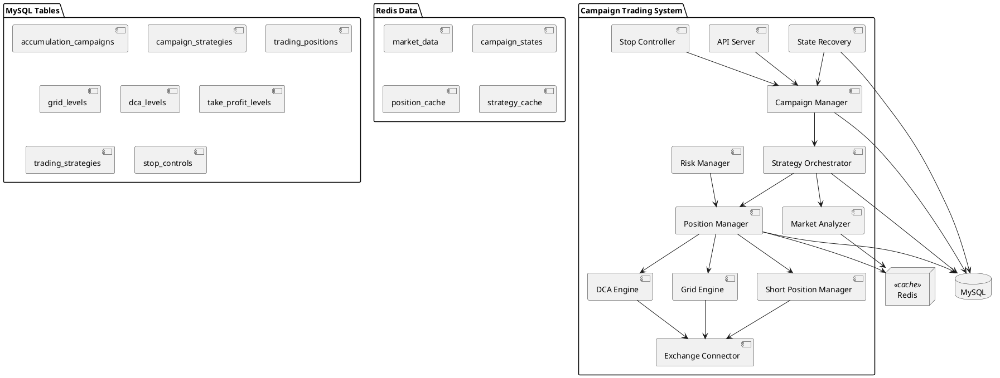
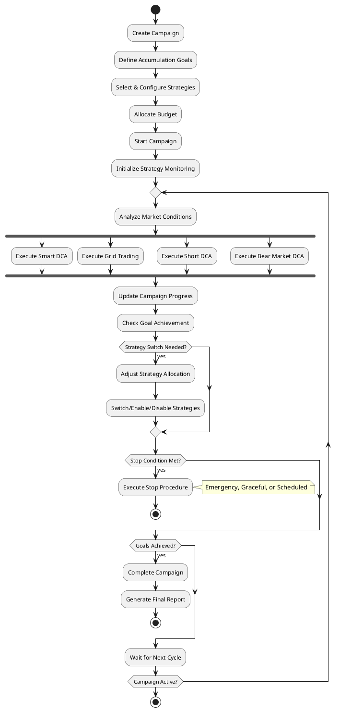
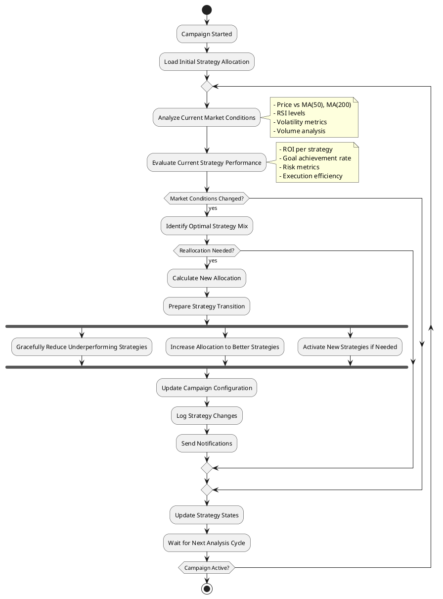
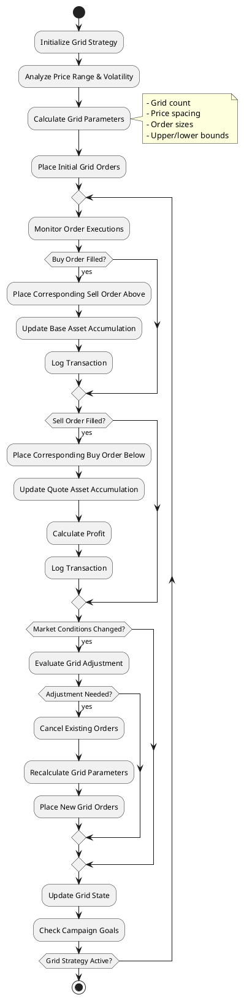
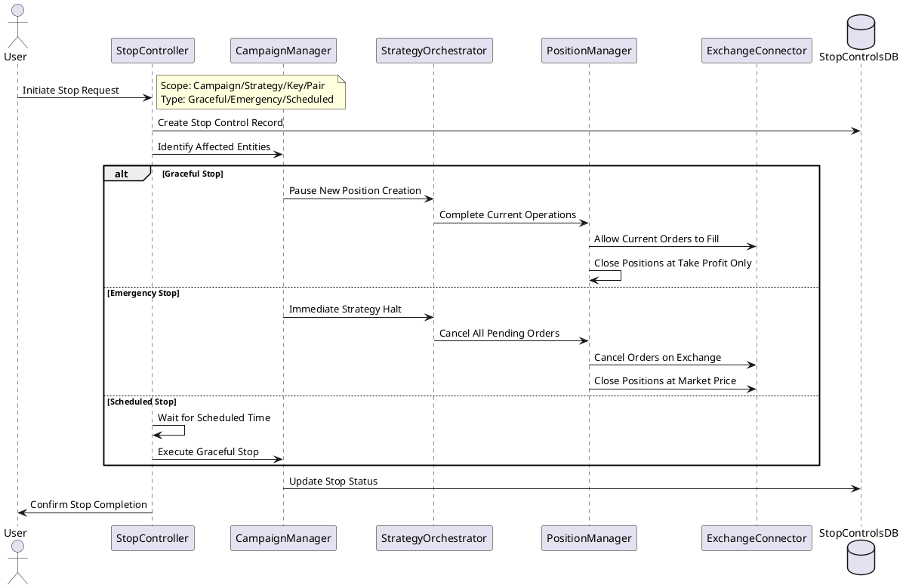
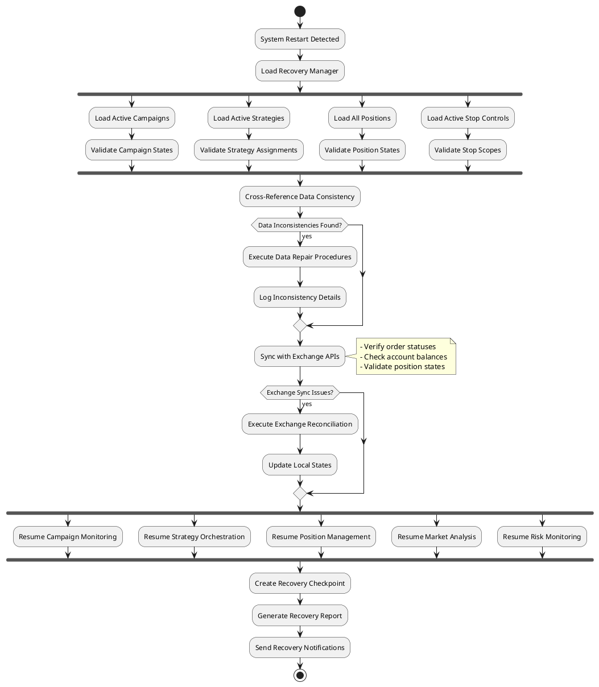
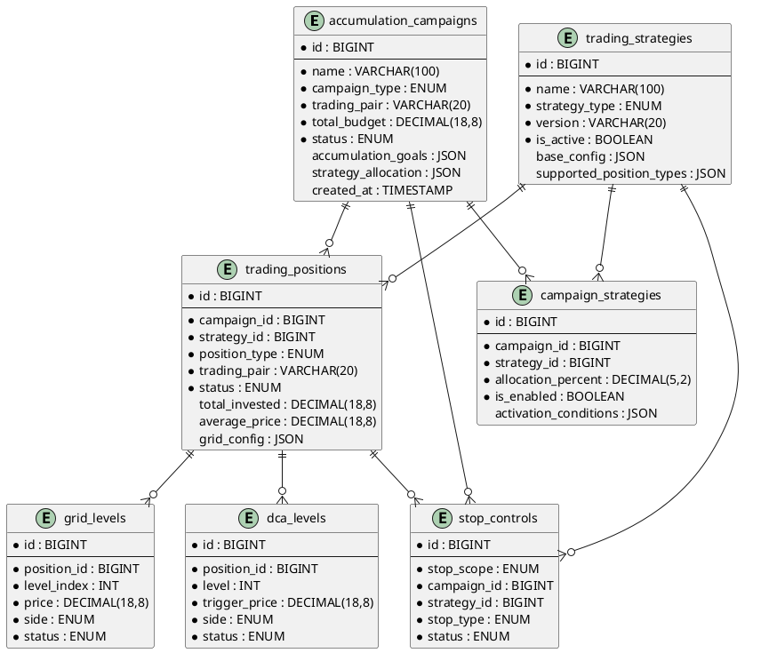

# Техническое задание: Бот для спотовой торговли с Smart DCA стратегией (TDD)

> ⚠️ В этом документе описывается реализация Smart DCA стратегии: архитектура, схемы БД для позиций, алгоритмы DCA, механизмы восстановления состояния позиций, безопасности и мониторинга.

## 1. Обзор проекта
- Enterprise-grade бот для спотовой торговли с **Smart DCA стратегией**.
- **Принцип "никогда не продавать в убыток"** - только LONG позиции.
- Многоключевое управление API с привязкой к DCA позициям.
- Критические системы безопасности и восстановления состояния позиций.
- Нулевая потеря данных о позициях (state recovery).

## 2. Архитектура системы
- Backend: Go v1.25 (новые системы: **Position State Manager**, **DCA Engine**, Key Manager, Trading Engine).
- DB: MySQL 8 (позиции, DCA уровни, история операций, WAL).
- Redis: кэш (котировки, состояние позиций, статистика).
- API: RESTful (React клиент + Position Management + Emergency Stop + Key Management).
- Биржи: HitBTC (MVP), Binance (следующая версия).
- Безопасность: AES-256-GCM для ключей, WAL encryption, distributed locks для позиций.

## 3. Критически важные системы для DCA
- **Position State Recovery**: восстановление состояния всех активных DCA позиций после сбоя <30 сек.
- **DCA Trigger Engine**: мониторинг цен и автоматическое срабатывание DCA уровней.
- **Take Profit Manager**: управление частичными продажами только в профите.
- **Emergency Position Management**: экстренная остановка всех позиций с сохранением состояния.
- **Advanced Risk Management**: контроль экспозиции на ключ/пару, защита от переторговки.
- **Enterprise Monitoring**: Prometheus, Grafana, мониторинг эффективности DCA стратегии.

## 4. Функциональные требования для DCA
- Управление DCA позициями (создание, мониторинг, завершение).
- Автоматическое срабатывание DCA уровней при падении цены.
- Частичные продажи только выше средней цены позиции.
- Привязка позиций к API ключам с балансировкой нагрузки.
- Восстановление состояния позиций после перезапуска.
- Управление рисками: максимальная экспозиция на ключ, лимиты позиций.

## 5. API спецификация для DCA (расширенная)

### 5.1 Управление позициями
```http
POST /api/v1/positions - создать новую DCA позицию
GET /api/v1/positions - список активных позиций
GET /api/v1/positions/{id} - детали позиции
PUT /api/v1/positions/{id}/pause - приостановить позицию
PUT /api/v1/positions/{id}/resume - возобновить позицию
DELETE /api/v1/positions/{id} - экстренно закрыть позицию
```

### 5.2 Мониторинг DCA
```http
GET /api/v1/positions/{id}/dca-levels - текущие DCA уровни
GET /api/v1/positions/{id}/take-profits - уровни take profit
GET /api/v1/positions/{id}/history - история операций по позиции
GET /api/v1/analytics/dca-performance - аналитика эффективности DCA
```

### 5.3 Настройки стратегии
```http
GET /api/v1/strategy/dca-settings - текущие настройки DCA
PUT /api/v1/strategy/dca-settings - обновить настройки DCA
GET /api/v1/strategy/supported-pairs - поддерживаемые торговые пары
```

## 6. Схемы БД для DCA стратегии

### 6.1 Основные таблицы позиций
```sql
-- Основная таблица DCA позиций
CREATE TABLE dca_positions (
    id BIGINT PRIMARY KEY AUTO_INCREMENT,
    trading_pair VARCHAR(20) NOT NULL,
    api_key_id BIGINT NOT NULL,

    -- Состояние позиции
    status ENUM('active', 'completed', 'paused', 'emergency_stopped') DEFAULT 'active',

    -- Финансовые данные
    total_invested DECIMAL(18,8) DEFAULT 0,
    total_quantity DECIMAL(18,8) DEFAULT 0,
    average_price DECIMAL(18,8) DEFAULT 0,
    realized_profit DECIMAL(18,8) DEFAULT 0,

    -- DCA параметры
    initial_amount DECIMAL(18,8) NOT NULL,
    max_dca_levels INT DEFAULT 3,
    current_dca_level INT DEFAULT 0,

    -- Временные метки
    created_at TIMESTAMP DEFAULT CURRENT_TIMESTAMP,
    updated_at TIMESTAMP DEFAULT CURRENT_TIMESTAMP ON UPDATE CURRENT_TIMESTAMP,
    completed_at TIMESTAMP NULL,

    FOREIGN KEY (api_key_id) REFERENCES api_keys(id),
    INDEX idx_trading_pair_status (trading_pair, status),
    INDEX idx_api_key_active (api_key_id, status)
);

-- DCA уровни для каждой позиции
CREATE TABLE dca_levels (
    id BIGINT PRIMARY KEY AUTO_INCREMENT,
    position_id BIGINT NOT NULL,
    level INT NOT NULL,

    -- Параметры срабатывания
    trigger_price_percent DECIMAL(5,2) NOT NULL, -- % от входной цены (-3%, -7%, -12%)
    trigger_price DECIMAL(18,8) NOT NULL,
    amount DECIMAL(18,8) NOT NULL,

    -- Состояние
    status ENUM('pending', 'triggered', 'filled', 'cancelled') DEFAULT 'pending',
    triggered_at TIMESTAMP NULL,
    filled_at TIMESTAMP NULL,
    actual_price DECIMAL(18,8) NULL,
    actual_quantity DECIMAL(18,8) NULL,

    FOREIGN KEY (position_id) REFERENCES dca_positions(id) ON DELETE CASCADE,
    UNIQUE KEY unique_position_level (position_id, level),
    INDEX idx_trigger_price (trigger_price, status)
);

-- Take Profit уровни
CREATE TABLE take_profit_levels (
    id BIGINT PRIMARY KEY AUTO_INCREMENT,
    position_id BIGINT NOT NULL,
    level INT NOT NULL,

    -- Параметры срабатывания
    trigger_price_percent DECIMAL(5,2) NOT NULL, -- % от средней цены (+8%, +15%, +25%)
    trigger_price DECIMAL(18,8) NOT NULL,
    quantity_percent DECIMAL(5,2) NOT NULL, -- % позиции для продажи (25%, 35%, 40%)

    -- Состояние
    status ENUM('pending', 'triggered', 'filled', 'cancelled') DEFAULT 'pending',
    triggered_at TIMESTAMP NULL,
    filled_at TIMESTAMP NULL,
    actual_price DECIMAL(18,8) NULL,
    actual_quantity DECIMAL(18,8) NULL,
    profit_amount DECIMAL(18,8) NULL,

    FOREIGN KEY (position_id) REFERENCES dca_positions(id) ON DELETE CASCADE,
    UNIQUE KEY unique_position_tp_level (position_id, level),
    INDEX idx_tp_trigger_price (trigger_price, status)
);

-- История всех операций по позициям
CREATE TABLE position_transactions (
    id BIGINT PRIMARY KEY AUTO_INCREMENT,
    position_id BIGINT NOT NULL,
    transaction_type ENUM('buy_initial', 'buy_dca', 'sell_partial', 'sell_complete') NOT NULL,

    -- Детали транзакции
    price DECIMAL(18,8) NOT NULL,
    quantity DECIMAL(18,8) NOT NULL,
    amount DECIMAL(18,8) NOT NULL,
    fee DECIMAL(18,8) DEFAULT 0,

    -- Связь с DCA/TP уровнями
    dca_level_id BIGINT NULL,
    take_profit_level_id BIGINT NULL,

    -- Данные биржи
    exchange_order_id VARCHAR(100),
    exchange_trade_id VARCHAR(100),

    created_at TIMESTAMP DEFAULT CURRENT_TIMESTAMP,

    FOREIGN KEY (position_id) REFERENCES dca_positions(id),
    FOREIGN KEY (dca_level_id) REFERENCES dca_levels(id),
    FOREIGN KEY (take_profit_level_id) REFERENCES take_profit_levels(id),
    INDEX idx_position_type (position_id, transaction_type),
    INDEX idx_created_at (created_at)
);
```

### 6.2 Дополнительные таблицы
```sql
-- Настройки DCA стратегии
CREATE TABLE dca_strategy_settings (
    id BIGINT PRIMARY KEY AUTO_INCREMENT,
    trading_pair VARCHAR(20),

    -- DCA параметры
    initial_amount_percent DECIMAL(5,2) DEFAULT 50.00, -- % от депозита
    dca_level_1_percent DECIMAL(5,2) DEFAULT 3.00,     -- -3%
    dca_level_1_amount_percent DECIMAL(5,2) DEFAULT 15.00,
    dca_level_2_percent DECIMAL(5,2) DEFAULT 7.00,     -- -7%
    dca_level_2_amount_percent DECIMAL(5,2) DEFAULT 20.00,
    dca_level_3_percent DECIMAL(5,2) DEFAULT 12.00,    -- -12%
    dca_level_3_amount_percent DECIMAL(5,2) DEFAULT 15.00,

    -- Take Profit параметры
    take_profit_1_percent DECIMAL(5,2) DEFAULT 8.00,   -- +8%
    take_profit_1_quantity_percent DECIMAL(5,2) DEFAULT 25.00,
    take_profit_2_percent DECIMAL(5,2) DEFAULT 15.00,  -- +15%
    take_profit_2_quantity_percent DECIMAL(5,2) DEFAULT 35.00,
    take_profit_3_percent DECIMAL(5,2) DEFAULT 25.00,  -- +25%
    take_profit_3_quantity_percent DECIMAL(5,2) DEFAULT 40.00,

    -- Ограничения
    max_positions_per_key INT DEFAULT 3,
    max_amount_per_position DECIMAL(18,8) DEFAULT 500.00,

    is_active BOOLEAN DEFAULT TRUE,
    created_at TIMESTAMP DEFAULT CURRENT_TIMESTAMP,
    updated_at TIMESTAMP DEFAULT CURRENT_TIMESTAMP ON UPDATE CURRENT_TIMESTAMP,

    UNIQUE KEY unique_pair_settings (trading_pair)
);

-- Мониторинг состояния позиций для восстановления
CREATE TABLE position_state_checkpoints (
    id BIGINT PRIMARY KEY AUTO_INCREMENT,
    position_id BIGINT NOT NULL,

    -- Снимок состояния
    state_data JSON NOT NULL, -- Полное состояние позиции
    checkpoint_type ENUM('periodic', 'before_trade', 'after_trade', 'emergency') NOT NULL,

    created_at TIMESTAMP DEFAULT CURRENT_TIMESTAMP,

    FOREIGN KEY (position_id) REFERENCES dca_positions(id) ON DELETE CASCADE,
    INDEX idx_position_checkpoint (position_id, created_at DESC)
);
```

## 7. Алгоритмы DCA стратегии

### 7.1 Алгоритм создания DCA позиции
```go
func CreateDCAPosition(pair string, depositAmount decimal.Decimal, keyID int64) {
    // 1. Получить настройки стратегии для пары
    settings := GetDCASettings(pair)

    // 2. Рассчитать размеры ордеров
    initialAmount := depositAmount.Mul(settings.InitialAmountPercent.Div(100))

    // 3. Создать позицию в БД
    position := &DCAPosition{
        TradingPair: pair,
        APIKeyID: keyID,
        InitialAmount: initialAmount,
        Status: "active",
    }

    // 4. Разместить начальный ордер на покупку
    entryPrice := PlaceInitialBuyOrder(position, initialAmount)
    position.AveragePrice = entryPrice
    position.TotalInvested = initialAmount

    // 5. Создать DCA уровни
    CreateDCALevels(position, settings)

    // 6. Создать Take Profit уровни
    CreateTakeProfitLevels(position, settings)

    // 7. Сохранить checkpoint состояния
    SavePositionCheckpoint(position, "after_trade")
}
```

### 7.2 Алгоритм мониторинга DCA триггеров
```go
func MonitorDCATriggers() {
    for {
        // 1. Получить все активные позиции
        activePositions := GetActivePositions()

        for _, position := range activePositions {
            currentPrice := GetCurrentPrice(position.TradingPair)

            // 2. Проверить DCA триггеры
            CheckDCATriggers(position, currentPrice)

            // 3. Проверить Take Profit триггеры
            CheckTakeProfitTriggers(position, currentPrice)
        }

        time.Sleep(1 * time.Second) // Проверка каждую секунду
    }
}

func CheckDCATriggers(position *DCAPosition, currentPrice decimal.Decimal) {
    pendingLevels := GetPendingDCALevels(position.ID)

    for _, level := range pendingLevels {
        if currentPrice.LessThanOrEqual(level.TriggerPrice) {
            // Триггер сработал - выполнить DCA покупку
            ExecuteDCABuy(position, level, currentPrice)
        }
    }
}
```

### 7.3 Алгоритм восстановления состояния позиций
```go
func RecoverPositionStates() error {
    // 1. Получить все активные позиции из БД
    activePositions := GetActivePositionsFromDB()

    for _, position := range activePositions {
        // 2. Восстановить состояние с последнего checkpoint
        lastCheckpoint := GetLatestCheckpoint(position.ID)

        // 3. Проверить статус ордеров на бирже
        SyncOrderStatesWithExchange(position)

        // 4. Пересчитать среднюю цену и уровни
        RecalculatePositionMetrics(position)

        // 5. Возобновить мониторинг
        StartMonitoring(position)

        log.Info("Position recovered", "id", position.ID, "pair", position.TradingPair)
    }

    return nil
}
```

## 8. Конфигурация DCA стратегии (пример YAML)
```yaml
dca_strategy:
  default_settings:
    initial_amount_percent: 50.0    # 50% депозита на первую покупку
    dca_levels:
      - trigger_percent: -3.0       # Первый DCA при -3%
        amount_percent: 15.0        # 15% депозита
      - trigger_percent: -7.0       # Второй DCA при -7%
        amount_percent: 20.0        # 20% депозита
      - trigger_percent: -12.0      # Третий DCA при -12%
        amount_percent: 15.0        # 15% депозита

    take_profit_levels:
      - trigger_percent: 8.0        # Первый TP при +8%
        quantity_percent: 25.0      # Продать 25% позиции
      - trigger_percent: 15.0       # Второй TP при +15%
        quantity_percent: 35.0      # Продать 35% позиции
      - trigger_percent: 25.0       # Третий TP при +25%
        quantity_percent: 40.0      # Продать 40% позиции

  risk_management:
    max_positions_per_key: 3        # Максимум 3 позиции на ключ
    max_amount_per_position: 500    # Максимум $500 на позицию
    emergency_stop_loss_percent: -30 # Экстренная остановка при -30%

  monitoring:
    price_check_interval: 1s        # Проверка цен каждую секунду
    checkpoint_interval: 60s        # Checkpoint каждую минуту
    health_check_interval: 30s      # Проверка здоровья системы
```

## 9. Диаграммы архитектуры системы (PlantUML)

### 9.1 Общая архитектура системы кампаний


### 9.2 Жизненный цикл кампании накопления


### 9.3 Алгоритм выбора и переключения стратегий


### 9.4 Grid Trading алгоритм


### 9.5 Система остановок (Stop Controls)


### 9.6 State Recovery процесс


### 9.7 Модель данных (Entity Relationship)

